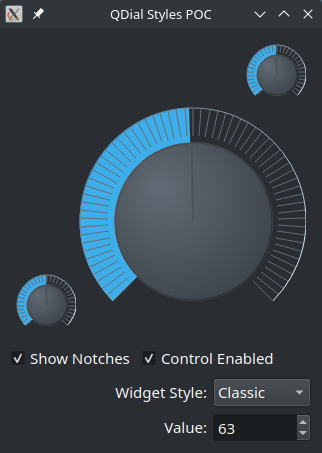

# dialstyles
QDial Styles for Qt5 and Qt6

This project is a collection of QStyle classes for the QDial component and a demo/POC program.
It includes the following classes:

* ClassicStyle
* PeppinoStyle
* SkulptureStyle
* VokiStyle

The "Legacy" style option corresponds to the current application style.

I've developed this POC long time ago for the [QSynth](/pedrolcl/qsynth) application, and the styles have been included on it since release v0.3.9 in 2008. One year later, I've also added the SkulptureStyle.

The demo program uses the `setStyle` method of QDial to assign one style to all QDial instances, without needing to change the main style of the application, or knowing how many QDial instances are currently displayed on a window:

    QList<QDial *> all = findChildren<QDial *>();
    foreach (QDial *d, all) {
        d->setStyle(m_style);
    }

## License
SPDX-License-Identifier: GPL-2.0-or-later  
Copyright 2008-2024 Pedro López-Cabanillas  
[SPDX License Identifier](https://spdx.org/licenses/GPL-2.0-or-later.html)
